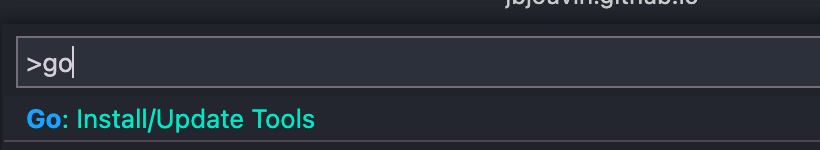
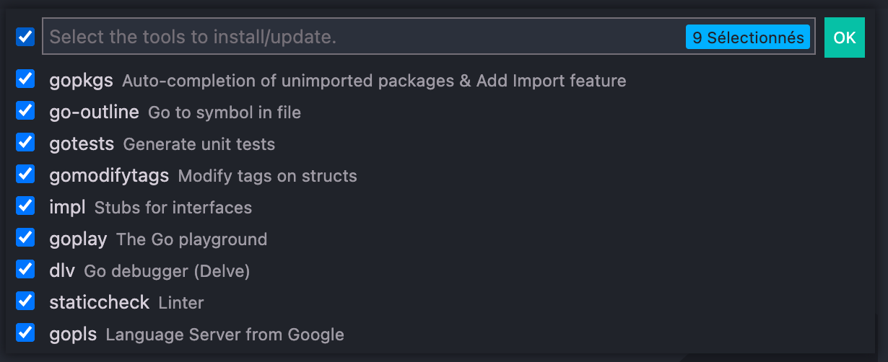

## Used Extensions

- `Dracula`
- `Python`
- `Prettier`
- `Material Icon Theme`
- `Go`
- `Path Intelisense`
- `Bracket Pair Colorized`
- `Vetur`
- `EditorConfig`
- `Indent Rainbow`
- `Polacode`
- `Settings Sync`

## Go

    ctrl+shift+p

