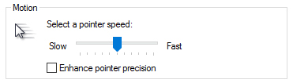

*sc2 params thanks to: [www.TerranCraft.com](https://terrancraft.com/the-elementary-series/)*

- [Graphics](#graphics)
- [Graphics and Textures:](#graphics-and-textures)
- [Sound](#sound)
- [Control](#control)
- [mouse](#mouse)
- [Gameplay](#gameplay)
- [Hybrid Settings](#hybrid-settings)

## Graphics

- Display mode: **Fullscreen**
- Resolution: **1920 x 1080**
- Vertical syn: **Disable**
- Refresh rate: **Default**
- Reduced violence: **Enable**

## Graphics and Textures:

- **High** for **models**
- **Medium** for **shaders, shadows and effects**
- **Low** for everything else

## Sound

- Music: **Disable**
- Ambient sound: **Disable**
- Move sound: **100%**
- Sound quality: **Low**
- Voices sound: **Enable**
- Error sound: **Enable**

## Control

*Set your window mouse setting to the following before you do the in game changes below.*

## mouse

- Mouse sensitivity: **Enable**
- Mouse sensitivity: **52%**
- Mouse wheel zoom: **Enable**
- Reduce mouse lag: **Disable**
- Windows key: **Disable**
- Mouse scroll: **Enable**
- Invert drag scroll: **Disable**
- Smart camera pan: **Disable**

## Gameplay

- Alert: **Disable**
- Game timer: **Enable**
- Build grid: **Enable**
- Work status: **Enable**
- Current order indicator: **Enable**
- Select all larva: **Disable**
- Enemy unit selection: **Enable**
- Experience points: **Enable**
- Show unit life bar: **Always or damaged**
- Control group: **Unclickable or hidden**
- Flyer helper: **Always**

## Hybrid Settings

[Hybrid Settings](http://www.teamliquid.net/forum/starcraft-2/498454-hybrid-settings-30-lotv-edition#top)
