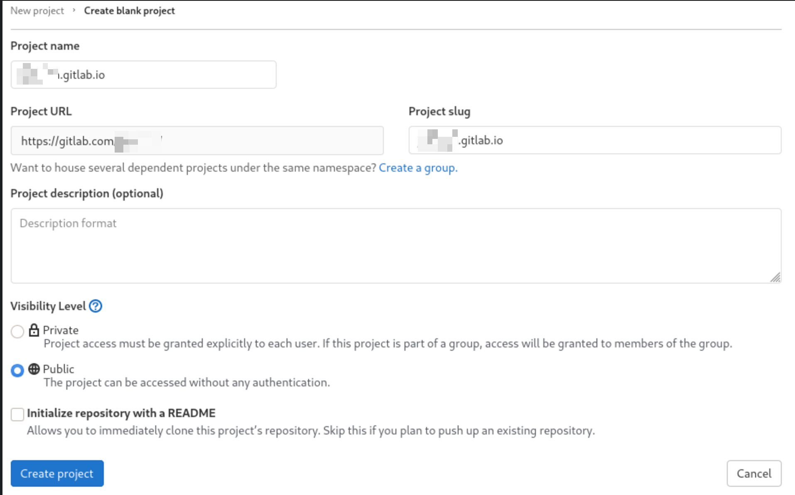
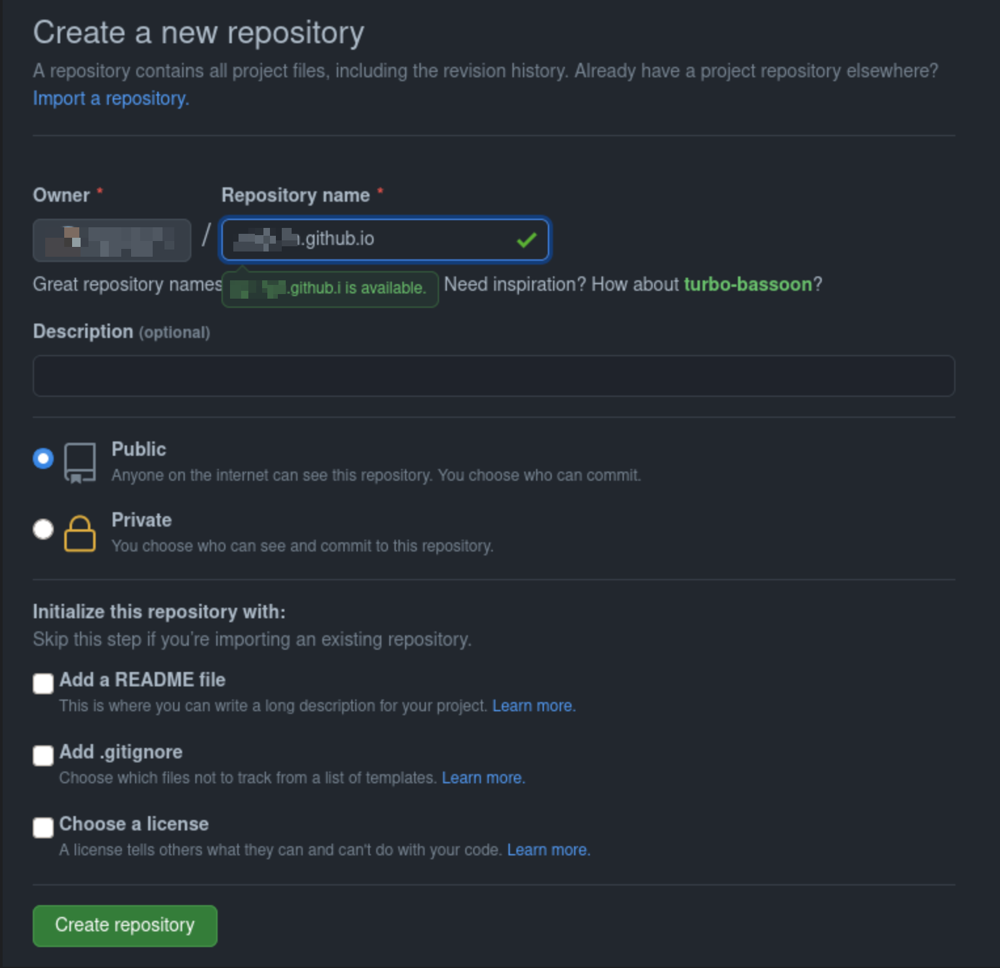

Hello,

A small trick to have your static website hosted on github + gitlab, with the same source code.

Why ? If one fall of course ! :D
And also because it's fun, at least i think it's fun :)

<!-- more -->

## Gitlab - Master

- create our static website repo
- add web stuff inside the repo
- configure CI

### create our static website repo

let's pretend our repo name is `upcreid.gitlab.io` and it's a [hugo](https://gohugo.io/) static website.
Let's create it and make it public



then the usual stuff:

```shell
git clone git@gitlab.com:upcreid/upcreid.gitlab.io.git
cd upcreid.gitlab.io
touch README.md
git add README.md
git commit -m "add README"
git push -u origin master
```

### create gh-pages branch

before going further we'll need to create a gh-pages branch on gitlab side, this in order to not break the CI when pushing without a gh-pages branch.

Go then !

```shell
git checkout --orphan gh-pages
git rm --cached -r .
git commit -m "new gh-pages branch" --allow-empty
git push origin gh-pages
```

go back to master

```shell
git checkout master
```

### add web stuff inside the repo

Ok, now let's add some code inside to have some static shit in there.

- Install [hugo](https://gohugo.io/getting-started/quick-start/)
- Create new site

```shell
hugo new site --force .
```

- Install a theme

```shell
git submodule add https://github.com/theNewDynamic/gohugo-theme-ananke.git themes/ananke
```

- add the theme, name and remove baseURL to the conf file

```shell
echo $'languageCode = \"en-us\"\ntitle = \"upcreid.gitlab.io\"\ntheme = \"ananke\"' > config.toml
```

- Start the server to verify if everythin goes ok

```shell
hugo server
```

- Commit

```shell
git add .
git commit -m "add basic hugo"
git push
```

### configure CI

Complicated !

Just add one more file to the repo...

.gitlab-ci.yml

```shell
image: registry.gitlab.com/pages/hugo:latest

variables:
  GIT_SUBMODULE_STRATEGY: recursive

pages:
  script:
  - hugo -b "https://upcreid.gitlab.io"
  artifacts:
    paths:
    - public
  only:
  - master
```

- Commit

```shell
git add .
git commit -m "add basic hugo"
git push
```

and voila => [https://upcreid.gitlab.io](https://upcreid.gitlab.io)

Now, let's handle github.

## Github - Mirror

- create our static website repo
- branch configuration
- git mirror
- configure CI

### create our static website repo



### Branch configuration

After creation, create a branch called master. To be in phase with gitlab

```shell
echo "# upcreid.github.io" >> README.md
git init
git add README.md
git commit -m "first commit"
git branch -M master
git remote add origin git@github.com:upcreid/upcreid.github.io.git
git push -u origin master
```

### Git mirror

Main part of this is to trigger the mirroring on gitlab side.
So inside gitlab repo, simply launch

```shell
git remote add --mirror=push github git@github.com:upcreid/upcreid.github.io.git
```

So, we add a remote, and say it's a mirror (--mirror) and we name it github.

Verify

```shell
git remote -v
```

you should have something like:

```shell
github  git@github.com:upcreid/upcreid.github.io.git (fetch)
github  git@github.com:upcreid/upcreid.github.io.git (push)
origin  git@gitlab.com:upcreid/upcreid.gitlab.io.git (fetch)
origin  git@gitlab.com:upcreid/upcreid.gitlab.io.git (push)
```

### configure CI

Then create the github CI file, we'll use the github actions.
But we should commit those github action inside the gitlab repo.

So inside the gitlab repo aka master, create the following dir/file:

```shell
mkdir .github/workflows
```

```shell
touch .github/workflows/gh-pages.yml
```

And inside the gh-pages.yml

```shell
name: github pages

on:
  push:
    branches:
      - master

jobs:
  deploy:
    runs-on: ubuntu-18.04
    steps:
      - uses: actions/checkout@v2
        with:
          submodules: true  # Fetch Hugo themes (true OR recursive)
          fetch-depth: 0    # Fetch all history for .GitInfo and .Lastmod

      - name: Setup Hugo
        uses: peaceiris/actions-hugo@v2
        with:
          hugo-version: '0.81.0'

      - name: Build
        run: hugo -b "https://upcreid.github.io"

      - name: Deploy
        uses: peaceiris/actions-gh-pages@v3
        with:
          github_token: ${{ secrets.GITHUB_TOKEN }}
          publish_dir: ./public
```

And commit

```shell
git add .
git commit -m "add github CI"
git push origin && git push github
```

As you can see, last command is in fact 2 commands. in order to push on gitlab + github.
Some tricks can be made here to push with one command => [google](https://www.google.com)

And that's it => [https://upcreid.github.io/](https://upcreid.github.io/)

## Conclusion

Since you got 2 remote you'll need to push to those remote after commiting.

you can do that simply with

```shell
git push origin && git push github
```

Then, nothing more should be done and both CI will be triggered.

See you !
