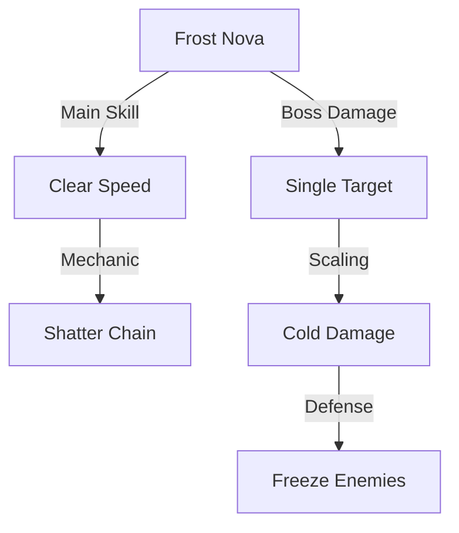
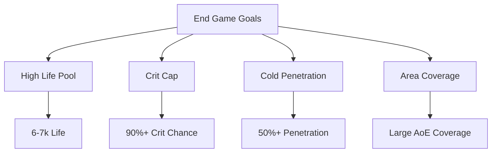

# Frost Nova Elementalist Build Guide

*Author: Based on Mathil's Build*  
*Last Updated: May 24, 2025*

This build focuses on using Frost Nova as the main skill, creating a satisfying chain reaction of cold explosions by combining it with Shatter mechanics. The build provides excellent clear speed and good single target damage through clever use of game mechanics and the Elementalist's powerful ascendancy nodes.

## Build Overview

## Core Mechanics

### Main Skills
- **Frost Nova**: Primary damage skill
- **Frost Shield**: Secondary defense layer
- **Arctic Armor**: Additional defense
- **Frostblink**: Movement skill

### Key Items
- **Crystal Crown**: For additional cold damage and area effect
- **Winter's Heart**: Converts physical damage to cold
- **Frostweave Gauntlets**: Adds cold damage to spells

## Ascendancy Choices

### Elementalist Passives Priority:
1. Heart of Ice (Essential)
2. Cold Mastery
3. Primal Aegis
4. Frigid Wake

## Skill Tree Path

### Early Game (Acts 1-5)
- Focus on spell damage nodes
- Pick up life nodes when possible
- Get key cold damage clusters

### Mid Game (Acts 6-10)
- Invest in crit multiplier
- Get essential life nodes
- Pick up key elemental damage nodes

### End Game
- Optimize crit chance and multiplier
- Get remaining life nodes
- Focus on cold penetration

## Gem Links

### Frost Nova 6-Link
1. Frost Nova
2. Increased Area of Effect
3. Cold Penetration
4. Controlled Destruction
5. Hypothermia
6. Elemental Focus

### Utility Links
- **Movement**: Frostblink - Faster Casting - Second Wind
- **Defense**: Frost Shield - Increased Duration - Arcane Surge
- **Auras**: Hatred - Herald of Ice - Enlighten

## Gearing Guide

### Weapon
- High spell damage base
- +1 to cold spell gems
- Critical strike multiplier
- Added cold damage to spells

### Body Armor
- High energy shield base
- Life
- Resistances
- Potential +1 to gems

### Accessories
- **Amulet**: +1 to cold skills, critical multiplier
- **Rings**: Life, resistances, cold damage
- **Belt**: Life, resistances, elemental damage

## Leveling Guide

### Act 1-3
1. Start with Frost Bolt
2. Get Frost Shield as soon as possible
3. Transition to Frost Nova when you have enough support gems

### Act 4-7
1. Focus on getting key life nodes
2. Start investing in crit nodes
3. Get essential unique items

### Act 8-10
1. Complete lab trials for ascendancy
2. Optimize gem links
3. Focus on maximizing cold damage

## End Game Goals

### Priority List
1. Cap resistances (75%+)
2. Achieve comfortable life pool (6k+)
3. Max crit chance
4. Optimize damage multipliers
5. Fine-tune clear speed

## Map Mods to Avoid
- Elemental Reflection
- No Regeneration
- -max Resistances

## Tips and Tricks
1. Use Frost Shield preemptively before engaging tough packs
2. Position yourself to maximize Frost Nova coverage
3. Keep Frost Shield up during boss fights
4. Use Frostblink offensively and defensively

## Video Guide Reference
For a visual guide of this build in action, check out [Mathil's Video Guide](https://www.youtube.com/watch?v=lBfzJOuZv3Y)

## Build Variations

### More Defense Focus
- Switch some damage nodes for life
- Use Arctic Armor instead of another aura
- Consider running Determination

### More Damage Focus
- Drop some life nodes for crit multiplier
- Use Glass Cannon setup
- Focus on cold penetration

Remember to adjust the build based on your playstyle and gear availability. This build offers good flexibility between defense and offense depending on your preferences.
